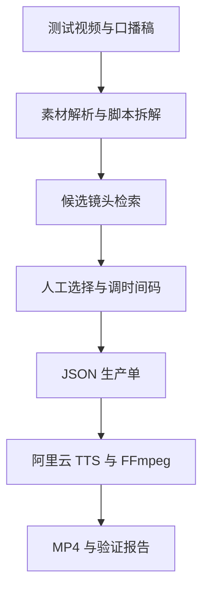

# 数智博主视频镜头检索最小技术验证设计

## 1. 目标

使用一段 20–30 分钟的真实影视素材和一份已确认的口播稿，验证系统能否根据视频脚本找到可剪辑的镜头，经人工选择后生成可执行生产单，并自动合成一条三分钟以内的 MP4 样片。

本项目只回答三个技术问题：

1. 视频脚本能否找到剧情、人物、场景和情绪基本正确的候选镜头。
2. 候选镜头的入点、出点和连续性是否达到可剪辑程度。
3. 选定镜头能否稳定转换为生产单，并通过 TTS 与 FFmpeg 输出成片。

## 2. 范围

### 包含

- 单部作品、20–30 分钟素材。
- 一份人工确认的口播稿。
- 台词和画面信息的联合检索。
- 每个脚本段最多返回 3 个候选镜头。
- 人工采用、淘汰、调整时间码。
- JSON 生产单。
- 阿里云 TTS 配音。
- FFmpeg 剪切、拼接、字幕与 MP4 输出。
- 候选可用率、素材覆盖率、人工修改量、耗时和费用记录。

### 不包含

- 完整媒资管理系统。
- 全片库批量标注和长期在线服务。
- 博主库、内容库、权限、数据大屏等运营后台。
- 选题、人设和文案生成能力验证。
- 自训练视频理解模型。

## 3. 系统边界

项目分为五个可单独验收的单元：

1. **素材解析**：读取视频信息、字幕、关键帧、镜头边界与时间码。
2. **脚本拆解**：将口播稿拆成画面需求，保留原文和顺序。
3. **镜头检索**：结合台词语义与画面描述，返回候选镜头和匹配理由。
4. **生产单编排**：记录选定素材、入点、出点、台词和顺序，并校验时长。
5. **成片合成**：调用阿里云 TTS，根据真实音频时长编排画面，使用 FFmpeg 输出字幕和 MP4。

每个单元都保存中间产物，用户无需等到最终 MP4 才能判断该阶段是否有效。

## 4. 数据流

## 5. 人工验证点

| 阶段 | 可查看产物 | 用户操作 |
|---|---|---|
| 素材解析 | 视频元数据、字幕、镜头列表和预览图 | 核对解析是否完整 |
| 脚本拆解 | 台词段落与画面需求表 | 修改或确认需求 |
| 镜头检索 | 每段最多 3 个候选片段 | 采用、淘汰、全部不合适 |
| 生产单 | JSON 与时间线预览 | 调整入点、出点或顺序 |
| 成片 | MP4 | 记录错配、黑帧、截断和字幕问题 |
| 结论 | 指标报告 | 决定继续开发、改方案或停止 |

## 6. 指标

- **候选可用率**：前 3 个候选中至少有 1 个可用镜头的脚本段数 ÷ 总脚本段数。
- **素材覆盖率**：现有素材能够支持的脚本段数 ÷ 总脚本段数。
- **人工修改量**：换镜头次数、时间码调整次数、改稿次数和操作分钟数。
- **耗时与费用**：首次素材解析、检索、TTS、合成分别记录。

试验达标线：候选可用率 ≥ 80%，成片 ≤ 3 分钟，且没有明显错配、黑帧、半句截断或字幕与配音错位。

## 7. 工具分工

- **执行位置**：用户的 Mac（Apple silicon）；不再使用 Codex 云端执行视频处理或 AGY 编码。详见 `LOCAL_START.md`。
- **Antigravity CLI**：在 Mac 上按照阶段任务实现代码并输出结果。
- **Codex**：拆解任务、下发提示、检查代码和运行结果、维护进度看板。
- **用户**：提供素材、口播稿和阿里云 TTS 配置，并在阶段节点确认产物。
- **Git/GitHub**：保存代码、文档和阶段提交；视频、密钥和大体积输出不进入仓库。
- **GPT 镜头理解**：程序导出带镜头 ID、时间码的抽帧与字幕包，用户交给当前会话分析，结构化结果再导回 Mac。没有 GPT API，禁止假设程序能直接使用 Plus 额度调用模型。独立标注素材后再按脚本检索，记录模型参与步骤；该验证不等于后台无人值守生产验证。
- **监督入口**：当前会话不能直接操作 Mac。优先使用可访问的 GitHub 仓库与本地阶段报告；GitHub 尚未接通时，以用户上传的代码变更和阶段报告交接。

## 8. 凭据和数据处理

- 阿里云 TTS 密钥只通过环境变量或本地 `.env` 提供，不写入代码、文档、日志或 Git。
- 测试视频保存在 `data/input/`，默认不提交 GitHub。
- 中间文件和成片保存在 `data/work/` 与 `outputs/`，默认不提交 GitHub。
- GitHub 只管理代码、配置模板、文档和小型验证报告。

## 9. 阶段完成定义

某阶段只有同时满足以下条件才算完成：

1. 阶段产物可以被用户直接打开或运行。
2. 自动检查通过，失败信息可理解。
3. `PROGRESS.md` 已更新状态、完成度和阻塞项。
4. 阶段变更已经提交到 Git。

## 10. 额度耗尽后的自动续跑

开发任务必须以小任务和 Git 提交为检查点，避免额度耗尽后重复整段工作。

- Antigravity 每次运行保存任务 ID、会话 ID、最后成功提交和状态。额度错误发生时写入 `waiting_antigravity_quota` 和下一次尝试时间；额度恢复后使用原会话 ID 继续。
- 如果错误信息提供明确刷新时间，则按该时间加安全缓冲后继续；如果没有提供，则五小时后首次重试，之后每小时重试一次。
- GPT/Codex 额度耗尽时保存审查检查点；自动唤醒能力尚未接通，不能当作已实现。恢复后读取最后提交与阶段报告继续审查；不将 GPT 套餐额度当作程序 API。
- AGY 续跑在 Mac 本地实现并验证后启用，不依赖当前临时云端进程。无刷新时间时的等待只是一种重试策略，不代表确认额度已恢复。到阶段验收点必须暂停，不能因额度恢复越过人工验收。
- GitHub 远程仓库配置后推送代码检查点；素材与凭据仍留在本地。Notion 看板记录当前任务、最后提交、等待原因和下一次尝试时间；本地程序不自动取得 Notion 凭据。
- 普通代码错误、测试失败、权限错误和素材缺失不得被误判为额度错误并无限重试。
